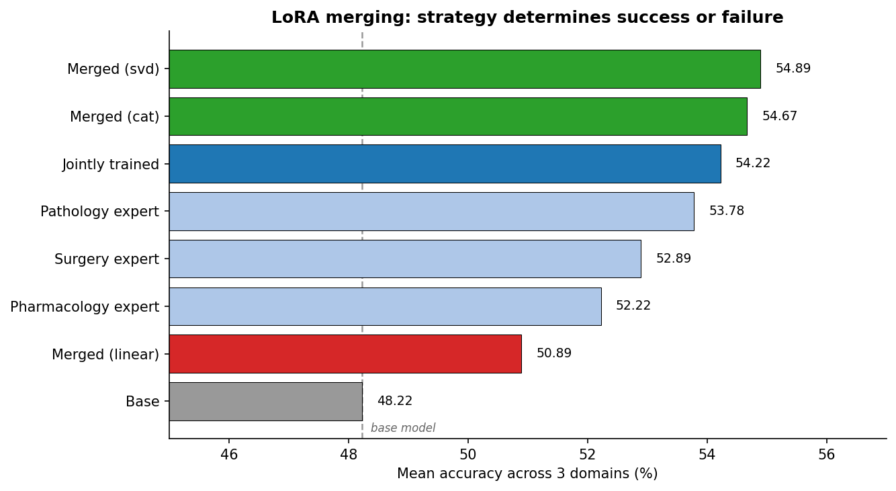

# 🧬 MedMCQA LoRA Expert Fusion


> **Training domain-specific LoRA experts on medical QA, then merging them — and
> finding that the merging strategy determines whether it works at all.**

**Author:** Zahia Yanes — Health Data & AI Engineer

---

## 🎯 Objective

Fine-tune three domain-specific LoRA adapters on medical multiple-choice questions,
then combine them into a single model. The guiding question:

> Can merging already-trained adapters match a model trained on all domains at once,
> without any additional training?

The short answer: **yes — but only if merged correctly.** Naive weight averaging,
the most intuitive approach, actively degrades performance.

This project was inspired by the *Decoding Biology Hackathon* (Owkin × AWS,
September 2025), where teams explored reasoning models for biology. It is an
independent reimplementation on public data.

---

## 🏗️ Pipeline Architecture

```
┌──────────────┐    ┌──────────────┐    ┌──────────────┐    ┌──────────────┐
│   MedMCQA    │───▶│  3 × LoRA    │───▶│   Merging    │───▶│  Comparison  │
│  182k MCQs   │    │   experts    │    │  strategies  │    │  vs joint    │
│  by subject  │    │  (frozen 1.5B│    │ linear/cat/  │    │   training   │
│              │    │   backbone)  │    │     svd      │    │              │
└──────────────┘    └──────────────┘    └──────────────┘    └──────────────┘
```

---

## 📊 Key Results



150 randomly sampled validation questions per domain (450 total), all models
evaluated identically via logit scoring.

| Model | Pharmacology | Pathology | Surgery | **Mean** |
|---|---|---|---|---|
| Base (Qwen2.5-1.5B-Instruct) | 51.33 | 50.00 | 43.33 | 48.22 |
| 🔴 **Merged (linear)** | 60.00 | 51.33 | **41.33** | **50.89** |
| Pharmacology expert | 60.00 | 52.67 | 44.00 | 52.22 |
| Surgery expert | 54.00 | 52.67 | 52.00 | 52.89 |
| Pathology expert | 56.00 | 56.67 | 48.67 | 53.78 |
| Jointly trained (45k examples) | **62.67** | 50.67 | 49.33 | 54.22 |
| 🟢 **Merged (cat)** | 58.67 | 56.00 | 49.33 | 54.67 |
| 🟢 **Merged (svd, rank 16)** | 58.00 | **56.67** | **50.00** | **54.89** |

### Finding 1 — Naive linear merging is harmful

Averaging adapters with `combination_type="linear"` scored **below the base model
on Surgery** (41.33 vs 43.33) and ranked last among all adapters.

The cause is structural. A LoRA adapter is a *product* of two matrices
(`ΔW = B·A`), not a single weight matrix. Averaging the factors separately gives:

```
B_merged · A_merged = w₁B₁A₁ + w₂B₂A₂ + (w₁B₂A₁ + w₂B₁A₂)
                      └── intended ──┘   └── cross-terms ──┘
```

The cross-terms pair one expert's `B` with another's `A`. They encode nothing that
was ever learned — they are noise injected into the model.

`combination_type="cat"` concatenates the factors instead, reproducing the intended
sum exactly. Switching strategies recovers **+3.8 points of mean accuracy** and
**+8 points on Surgery**, with no retraining.

### Finding 2 — Correct merging matches joint training, for free

| Approach | Mean accuracy | GPU time | Adapter size |
|---|---|---|---|
| Joint training (45,504 examples) | 54.22 | **54 min** | 17 MB |
| Merging (cat) | 54.67 | ~5 s | 50 MB |
| Merging (svd, rank 16) | **54.89** | ~5 s | **17 MB** |

These three are statistically indistinguishable (95% margin of error ≈ ±4.6 points
on 450 questions). SVD merging is the best trade-off: joint-training accuracy,
original adapter size, no retraining.

---

## 🔬 Method

### Data

[MedMCQA](https://huggingface.co/datasets/openlifescienceai/medmcqa) — 182,822
training questions across 21 medical subjects. Three domains selected for volume
and conceptual distinctness:

| Domain | Training examples | Validation questions |
|---|---|---|
| Pharmacology | 13,758 | 243 |
| Pathology | 14,884 | 337 |
| Surgery | 16,862 | 369 |

The `test` split has all labels set to `-1` (reserved for an external leaderboard),
so evaluation uses the `validation` split.

### LoRA configuration

Identical across all adapters — a hard requirement for merging, since averaging
weights is only valid if they share the same rank and target the same modules.

| Parameter | Value |
|---|---|
| Rank (`r`) | 16 |
| `lora_alpha` | 32 |
| `lora_dropout` | 0.05 |
| Target modules | `q_proj`, `k_proj`, `v_proj`, `o_proj` |
| Trainable parameters | 4.36M / 1.55B (**0.28%**) |
| Adapter size | ~17 MB (vs ~3 GB base model) |

### Prompt masking — the critical detail

The first training run **degraded** accuracy from 52% to 36%. Diagnostics showed
the model predicting "A" for 58% of questions, while only 28% of correct answers
are "A". It had learned the *prior distribution of answers*, not the content.

The cause: loss was computed over all ~104 tokens per example, but only **one** is
the answer. The learning signal was diluted by 99% of gradient spent reproducing
question text — both useless and inherently unpredictable.

Setting prompt labels to `-100` (ignored by PyTorch's cross-entropy) concentrates
all gradient on the answer token. This single change recovered normal behaviour.

### Evaluation

Rather than generating tokens and parsing the output letter, the final evaluation
reads logits at the last position and takes the argmax over the four option tokens.
Faster (one forward pass, batchable) and parsing-free by construction.

---

## 📂 Project Structure

```
medmcqa-lora-expert-fusion/
│
├── notebooks/
│   ├── 01_baseline_eval.ipynb          # Base model baseline per domain
│   ├── 02_lora_expert_training.ipynb   # Expert training + cross-domain eval
│   └── 03_merging_evaluation.ipynb     # Merging strategies vs joint training
│
├── outputs/figures/
│   └── 01_merging_comparison.png
│
├── requirements.txt
├── .gitignore
└── README.md
```

Adapter weights are not versioned (see `.gitignore`) — they are training artifacts,
reproducible from the notebooks.

---

## 🚀 Getting Started

Notebooks are designed for Google Colab (free T4 GPU).

```bash
git clone https://github.com/ZahiaYanes/medmcqa-lora-expert-fusion.git
```

Open each notebook in Colab, set the runtime to **T4 GPU**, and run.

Each notebook exposes flags controlling expensive cells:

```python
RERUN_HISTORICAL = False   # narrative runs (failed training, diagnostics)
RETRAIN_EXPERTS  = False   # ~55 min — expert training
TRAIN_JOINT      = False   # ~54 min — joint adapter
RUN_FULL_EVAL    = False   # ~20 min — final evaluation
```

Set to `True` to reproduce from scratch (~3h total on a T4). Outputs from the
original runs are preserved in the committed notebooks.

---

## ⚠️ Limitations

- **Sample size.** 150 questions per domain gives a 95% margin of error of roughly
  ±8 points per cell, ±4.6 points on the mean. Only the linear-merge degradation
  and base-to-adapter gains clearly exceed noise.
- **Single seed, single epoch, one model size.** Conclusions about merging
  strategies would need multiple seeds to be robust.
- **Domain overlap.** MedMCQA subjects are not cleanly separable — a pharmacology
  question may involve pathology. This explains the positive transfer observed
  (every expert improved every domain) and limits how "specialized" these experts
  really are.
- **Knowledge vs format.** We cannot distinguish genuine medical knowledge gains
  from adaptation to MedMCQA's question style. Evaluating on a held-out benchmark
  (MedQA, PubMedQA) would disentangle the two.
- **Notebooks 02 and 03 are not directly comparable** — two things changed at once
  (sequential → random sampling, generation → logit scoring).

## 🔭 Future Work

- **Chain-of-thought supervision.** MedMCQA includes an `exp` field with written
  explanations. Training the model to generate reasoning before answering would
  provide a far richer learning signal than a single letter.
- **Confidence calibration.** Measuring whether predicted confidence matches
  observed accuracy, via entropy and margin metrics.
- **Learned merge weights** instead of uniform 1/3, e.g. weighted by domain
  difficulty or validation performance.

---

## 🛠️ Tech Stack

| Tool | Usage |
|---|---|
| PyTorch, Transformers | Model loading and training |
| PEFT | LoRA adapters and merging strategies |
| Datasets (Hugging Face) | MedMCQA loading and filtering |
| matplotlib | Result visualization |
| Google Colab (T4) | GPU compute |

## 📚 References

- Hu, E. et al. (2021). [LoRA: Low-Rank Adaptation of Large Language Models](https://arxiv.org/abs/2106.09685). *arXiv:2106.09685*
- Wortsman, M. et al. (2022). [Model Soups: averaging weights of multiple fine-tuned models](https://arxiv.org/abs/2203.05482). *ICML 2022*
- Pal, A. et al. (2022). [MedMCQA: A Large-scale Multi-Subject Multi-Choice Dataset for Medical domain Question Answering](https://proceedings.mlr.press/v174/pal22a.html). *CHIL 2022*
- Qwen Team (2024). [Qwen2.5 Technical Report](https://arxiv.org/abs/2412.15115). *arXiv:2412.15115*

## 📝 License

MIT License — Copyright (c) 2025 Zahia Yanes